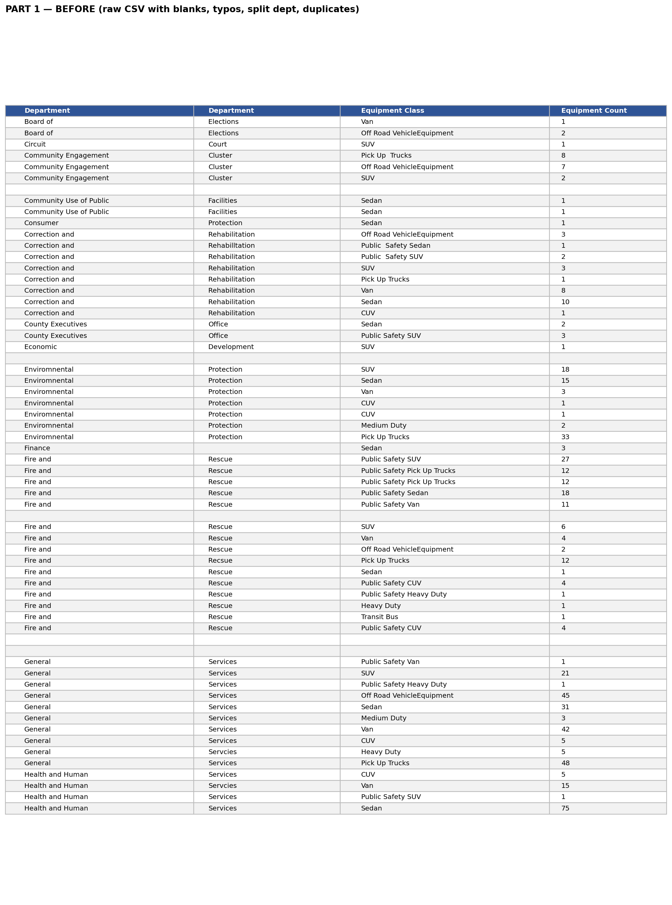
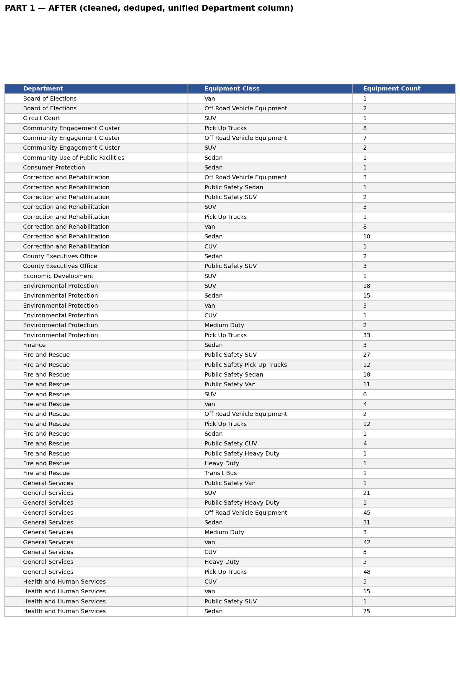
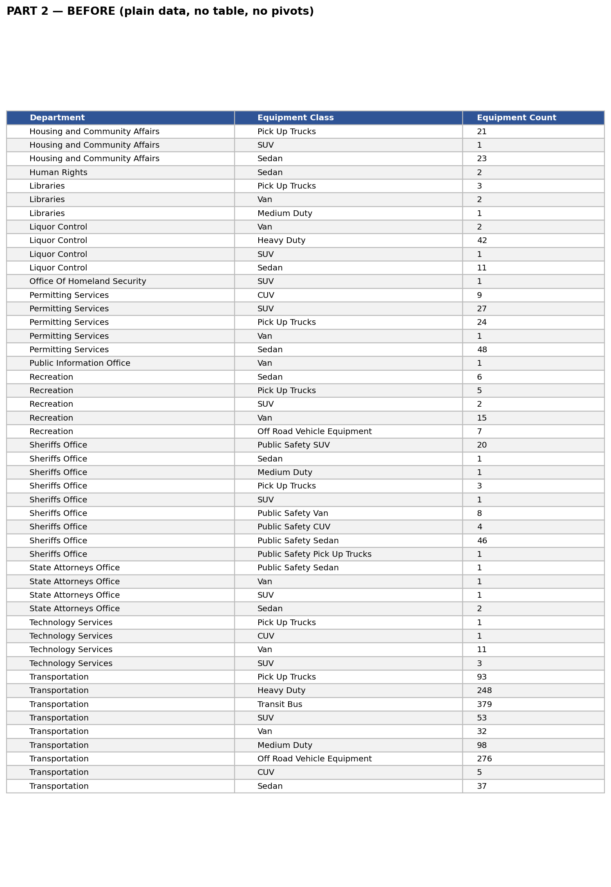
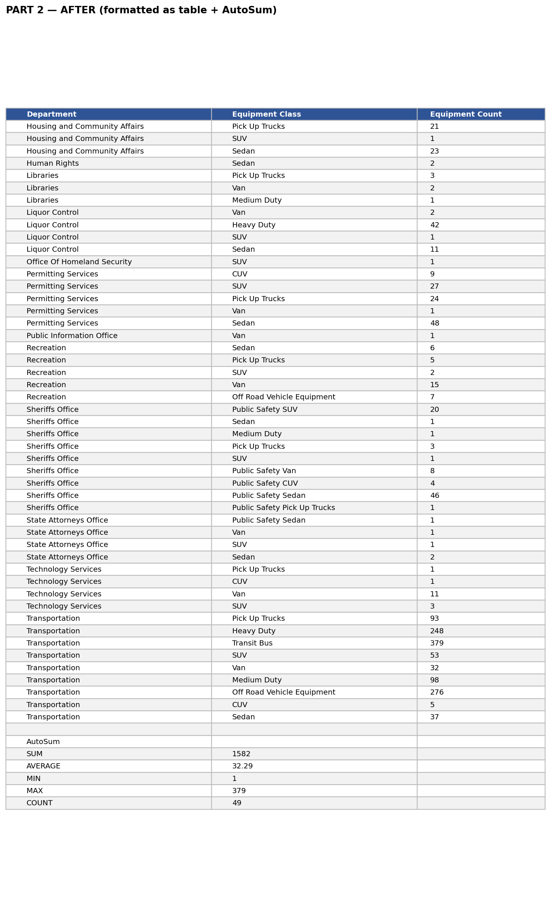
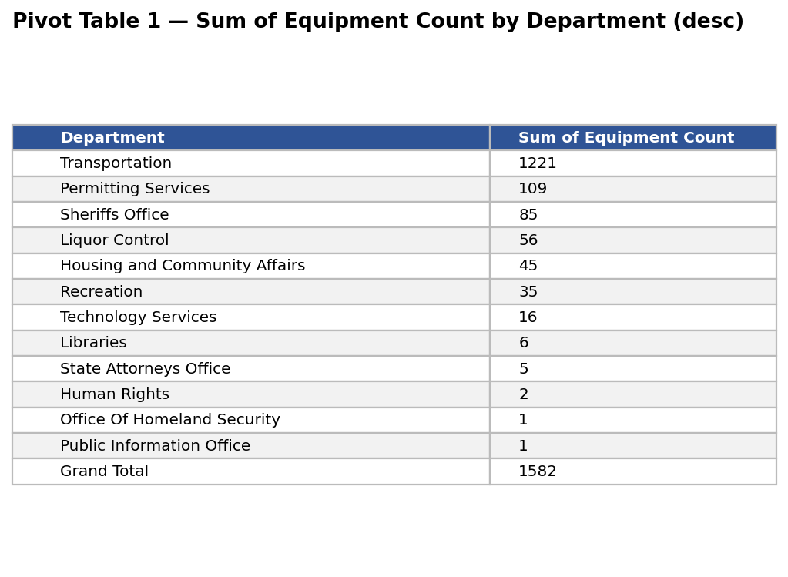
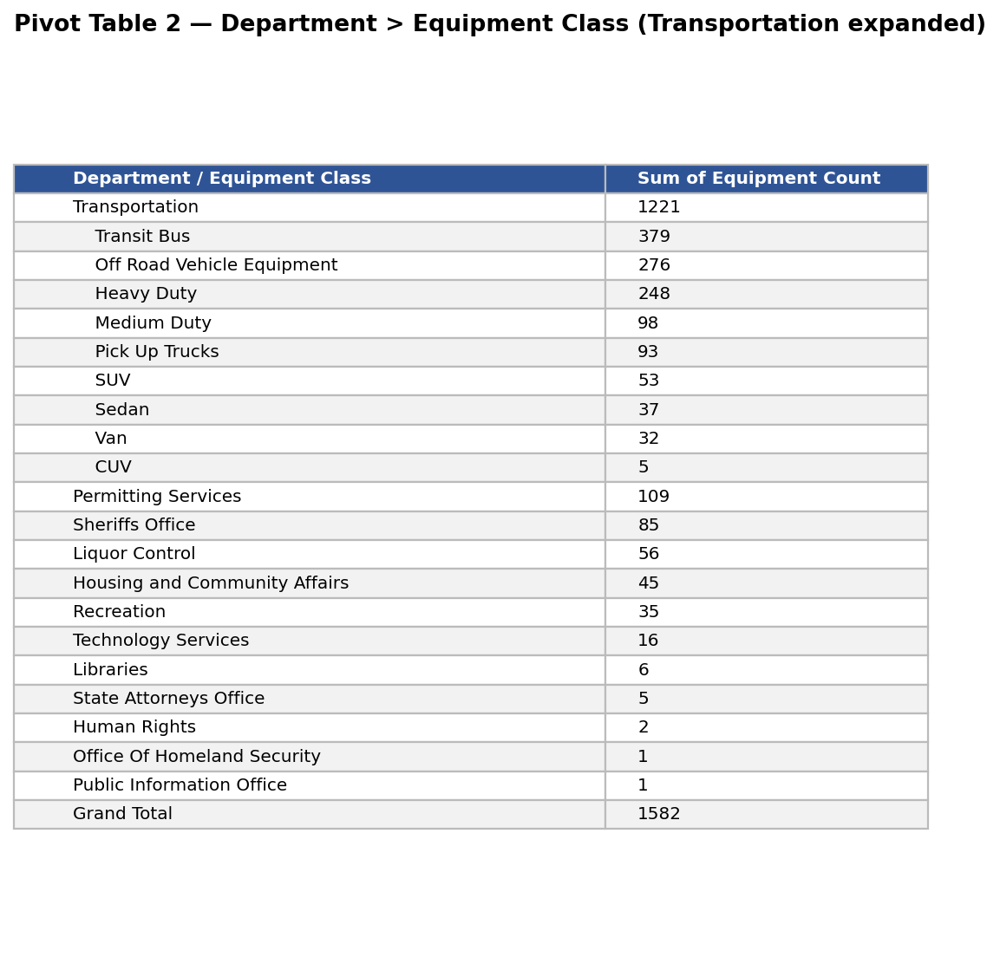
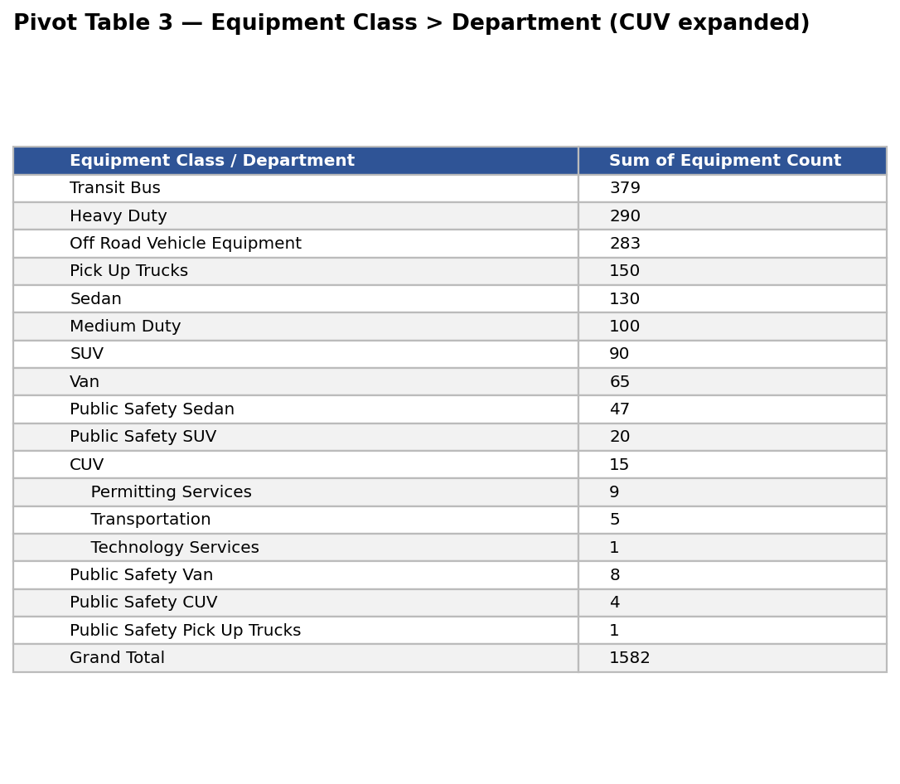

# Course 2: Excel Basics for Data Analysis

**Duracion estimada:** 11 horas
**Modulos:** 4

## Que cubre

Uso de Excel y Google Sheets para analisis de datos: importar y limpiar datos,
usar formulas y funciones, tablas dinamicas y filtros. Sin macros ni VBA —
enfocado en el analisis diario de un analista.

## Estado

Curso completado.

## Contenido del repo

- [`apuntes.md`](./apuntes.md) — resumen general del curso (los 4 modulos)
- [`modulo-1-intro-spreadsheets/`](./modulo-1-intro-spreadsheets/) — estructura, referencias, formulas basicas
  - [`apuntes.md`](./modulo-1-intro-spreadsheets/apuntes.md)
  - [`quiz-practica.md`](./modulo-1-intro-spreadsheets/quiz-practica.md)
  - [`actividades.md`](./modulo-1-intro-spreadsheets/actividades.md)
- [`modulo-2-data-quality-wrangling/`](./modulo-2-data-quality-wrangling/) — duplicados, nulos, limpieza de texto
  - [`apuntes.md`](./modulo-2-data-quality-wrangling/apuntes.md)
  - [`quiz-practica.md`](./modulo-2-data-quality-wrangling/quiz-practica.md)
  - [`actividades.md`](./modulo-2-data-quality-wrangling/actividades.md)
- [`modulo-3-analyzing-data/`](./modulo-3-analyzing-data/) — SI, BUSCARV, INDICE+COINCIDIR, estadisticas
  - [`apuntes.md`](./modulo-3-analyzing-data/apuntes.md)
  - [`quiz-practica.md`](./modulo-3-analyzing-data/quiz-practica.md)
  - [`actividades.md`](./modulo-3-analyzing-data/actividades.md)
- [`modulo-4-pivot-tables/`](./modulo-4-pivot-tables/) — tablas dinamicas, slicers, graficos dinamicos
  - [`apuntes.md`](./modulo-4-pivot-tables/apuntes.md)
  - [`quiz-practica.md`](./modulo-4-pivot-tables/quiz-practica.md)
  - [`actividades.md`](./modulo-4-pivot-tables/actividades.md)
- [`practica-excel/`](./practica-excel/) — ejercicios y final assignment

---

## Final Assignment — Montgomery Fleet Equipment Inventory

Proyecto de fin de modulo: limpieza de un dataset real del inventario de
vehiculos del condado de Montgomery y analisis con pivot tables.
Codigo y archivos en
[`practica-excel/final-assignment-montgomery-fleet/`](./practica-excel/final-assignment-montgomery-fleet/).

### Part 1 — Data cleaning (antes / despues)

CSV crudo con filas vacias, typos (`Rehabilltation`, `Enviromnental`,
`Recsue`...), dobles espacios, duplicados y la columna Department partida
en dos. Tras la limpieza: 53 filas unicas, una sola columna Department,
spelling corregido.

### Part 2 — Table + Pivot Tables

Datos formateados como tabla y tres pivots: sum por Department (desc),
Department > Equipment Class (Transportation expandido) y Equipment Class
> Department (CUV expandido). AutoSum col C: **SUM 1582 · AVG 32.29 · MIN 1
· MAX 379 · COUNT 49**.

